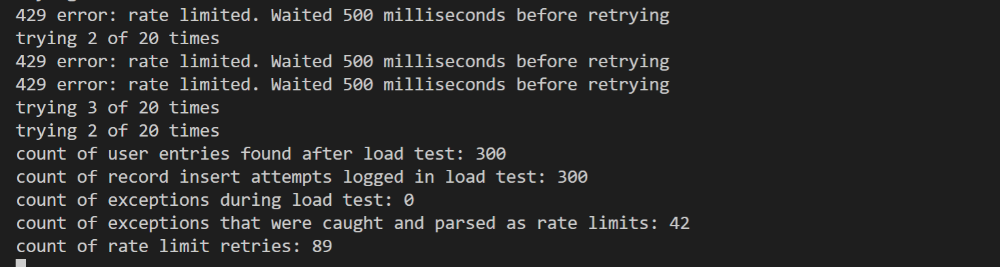
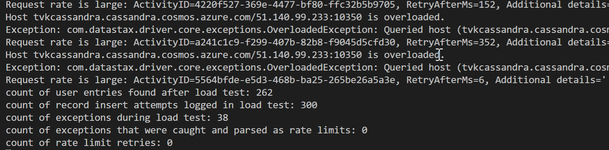

# Handling rate limited requests in the Azure Cosmos DB API for Cassandra
Azure Cosmos DB is a globally distributed multi-model database. One of the supported APIs is the Cassandra API. This sample illustrates how to handle rate limited requests (aka 429 errors) in Azure Cosmos DB by implementing retry logic based on the RetryAfterMs property returned from the service.

## Prerequisites
* Before you can run this sample, you must have the following prerequisites:
    * An active Azure Cassandra API account - If you don't have an account, refer to the [Create Cassandra API account](https://aka.ms/cassapijavaqs).
    * [Java Development Kit (JDK) 1.8+](http://www.oracle.com/technetwork/java/javase/downloads/jdk8-downloads-2133151.html)
        * On Ubuntu, run `apt-get install default-jdk` to install the JDK.
    * Be sure to set the JAVA_HOME environment variable to point to the folder where the JDK is installed.
    * [Download](http://maven.apache.org/download.cgi) and [install](http://maven.apache.org/install.html) a [Maven](http://maven.apache.org/) binary archive
        * On Ubuntu, you can run `apt-get install maven` to install Maven.
    * [Git](https://www.git-scm.com/)
        * On Ubuntu, you can run `sudo apt-get install git` to install Git.

## Running this sample
1. Clone this repository using `git clone git@github.com:Azure-Samples/azure-cosmos-db-cassandra-java-rate-limit-sample.git cosmosdb`.

2. Change directories to the repo using `cd cosmosdb/java-examples`

3. Next, substitute the Cassandra host, username, password  `java-examples\src\main\resources\config.properties` with your Cosmos DB account's values from connectionstring panel of the portal.

    ```
    cassandra_host=<FILLME>
    cassandra_username=<FILLME>
    cassandra_password=<FILLME>
    ssl_keystore_file_path=<FILLME>
    ssl_keystore_password=<FILLME>
    ```
    If ssl_keystore_file_path is not given in config.properties, then by default <JAVA_HOME>/jre/lib/security/cacerts will be used
    If ssl_keystore_password is not given in config.properties, then the default password 'changeit' will be used

5. Run `mvn clean install` from java-examples folder to build the project. This will generate cosmosdb-cassandra-examples.jar under target folder.
 
6. Run `java -cp target/cosmosdb-cassandra-examples.jar com.azure.cosmosdb.cassandra.examples.UserProfile` in a terminal to start your java application. The Sample should finish with a number of rate limited requests, but with all inserts successful after retries:

   

7. To observe the difference when running this test without handling rate limiting, comment the call to userRetry() method in the loadTest() method that is called from main(), and uncomment the line above it, as below, and then re-compile/run:

    ```java
        //uncomment the below and comment retryUser() to observe the difference if retry with back off is not used
        repository.insertUser(preparedStatement, guid.toString(), name, city);
        //u.retryUser(guid.toString(), name, city, repository, preparedStatement, noOfRetries, 1, u, false);
    ```

    You will see a difference in the number of attempted inserts and records found after the test, with rate limiting not handled:

    

## About the code
The code included in this sample is intended as a load test to simulate a scenario where Cosmos DB will rate limit requests (return a 429 error) because there are too many requests for the [provisioned throughput](https://docs.microsoft.com/azure/cosmos-db/how-to-provision-container-throughput) in the service. In this sample, we create a Keyspace and table, and run a multi-threaded process that will insert users concurrently into the user table (300 in total with 10 threads at 30 writes per thread). To help generate random data for users, we use a java library called "javafaker", which is included in the build dependencies. The loadTest() will eventually exhaust the provisioned Keyspace RU allocation (default is 400RUs). When ```OverloadedException``` is thrown, we parse the ```RetryAfterMs``` property from the text to determine millseconds to wait before retrying, with a maximum of 10 retry attempts.

We also catch ```NoHostAvailableException``` in order to implement an exponential back off and retry. However, please note that this is implemented purely as a fall back position; if this exception is returned, it is likely that Cosmos DB will not respond any further because provisioned throughput has been completely exhausted, such that not even rate limiting information can be returned. In a real life scenario, you should either manually or programmatically (preferable) increase the provisioned throughput *before reaching this point*. In production, you should handle 429 errors in a similar fashion to this sample, and monitor the system, increasing throughput if 429 errors are being returned. Note that you can do this programmatically in the Azure Cosmos DB API for Cassandra by executing [ALTER commends in CQL](https://docs.microsoft.com/azure/cosmos-db/cassandra-support#keyspace-and-table-options).

## Review the code

You can review the following files: `src/main/java/com/azure/cosmosdb/cassandra/util/CassandraUtils.java` and `src/main/java/com/azure/cosmosdb/cassandra/repository/UserRepository.java`.

Also take note of the following method in `com.azure.cosmosdb.cassandra.examples.UserProfile` which implements the retry logic:

   ```java
    public void retryUser(String id, String name, String city, UserRepository repository, PreparedStatement preparedStatement, int retries, int retry, UserProfile u, boolean stop) throws InterruptedException {
        if (retry >= retries){
            stop = true;
        }
        while(stop==false){
            try{
                repository.insertUser(preparedStatement, id, name,
                city);
            }
            catch (OverloadedException e) {
                retry++;
                try{
                    int retryWaitTime = getRetryAfterMs(e.toString(), retry);
                    u.ratelimitcount.incrementAndGet();;
                    Thread.sleep(retryWaitTime);
                    System.out.println("429 error: rate limited. Waited " + retryWaitTime + " milliseconds before retrying");
                    System.out.println("trying " + retry + " of "+retries+ " times");
                    try{
                        //recursively retry until break condition is met (stop = true)
                        u.retryUser(id, name, city, repository, preparedStatement, retries, retry, u, stop);
                    }
                    catch(Exception exx){
                        u.exceptioncount.incrementAndGet();;
                        System.out.println("retry failed: "+exx);
                    }
                }
                catch (Exception ex){
                    System.out.println("could not do retry from OverloadedException catch block: " + ex);
                }
            }
            catch(NoHostAvailableException ex){
                retry++;
                System.out.println("Caught NoHostAvailableException: " + ex);
                System.out.println("Inner Exception of NoHostAvailableException: " + ex.getCause());
                System.out.println("retrying " + retry + " of "+retries+ "times after NoHostAvailableException");

                //retrying with exponential back-off if NoHostAvailableException caught
                int waitTimeInMilliSeconds = (int) Math.pow(2, retry) * 100;
                Thread.sleep(waitTimeInMilliSeconds);
                u.retryUser(id, name, city, repository, preparedStatement, retries, retry, u, stop);
                u.exceptioncount.incrementAndGet();;
            }
            catch(Exception e){
                u.exceptioncount.incrementAndGet();;
                retry++;
                System.out.println("Exception: "+e);
            }
            finally{
                u.totalRetries.set(u.totalRetries.get() + retry -1);
                stop = true;
            }
        }
    }
   ```

## More information

- [Azure Cosmos DB](https://docs.microsoft.com/azure/cosmos-db/introduction)
- [Java driver Source](https://github.com/datastax/java-driver)
- [Java driver Documentation](https://docs.datastax.com/en/developer/java-driver/)
